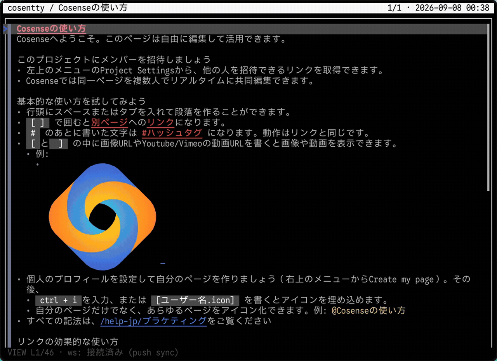
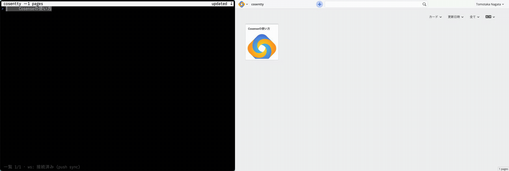

# cosentty

Cosense(旧 Scrapbox)のページを端末で読み、編集する TUI クライアント。
Cosense は Helpfeel 社の製品であり、cosentty は非公式のサードパーティ製ツールです。





(撮り方は [examples/demo/README.md](examples/demo/README.md))

## インストール

Rust 1.92 以上が必要です(古い場合は `rustup update stable`)。

```bash
cargo install cosentty
```

ソースから:

```bash
git clone https://github.com/worldnine/cosentty
cd cosentty/rust && cargo install --path .
```

外部バイナリは不要です。macOS では IME 制御とクリップボード画像の読み取りに
小さな Swift ヘルパを初回だけ `swiftc` でビルドします(無ければ自動で無効)。

## 使い方

```bash
cosentty help-jp                              # 公開プロジェクトのページ一覧
cosentty <project> <ページタイトル>             # ページを開く
cosentty https://scrapbox.io/help-jp/リンク    # URL 直貼りも可
cosentty                                      # 引数なし: 参加プロジェクトの一覧
```

### 認証

- 非公開プロジェクトの読み書きは、公式 CLI の [`cosense login`](https://www.npmjs.com/package/@helpfeel/cosense-cli)
  が保存する `~/.cosense/settings.json`(PAT / Service Account)を自動で使います
- `COSENSE_SID` 環境変数(ブラウザの `connect.sid`)はフォールバックで、
  ws push 同期・web レンダラ(mermaid)・プロジェクト設定の読み取りにだけ必要です
- 非公開プロジェクトのテーマ・表示名・画像の保存先は、`COSENSE_SID` が無くても
  `,` で開く設定画面から `~/.config/cosentty/config.toml` に書いておけます

## 開発

```bash
cd rust
cargo test                        # lib + viewer の全テスト(ネットワーク不要)
cargo run -- help-jp              # 手元でビューワを起動
cargo run --features dev-tools --bin probe -- help-jp   # 実測用バイナリ
```

実編集を伴う検証は、自分の非公開プロジェクトを 1 つ作って行ってください。
設計判断は `rust/docs/` の PLAN-*.md / NOTE-*.md / SPEC-*.md に、全体像は `HANDOFF.md` にあります。

## 主な機能

- **認証**: 公式 CLI（`cosense login`）の `~/.cosense/settings.json` を自動で使う
  （PAT / Service Account。`COSENSE_SID` はフォールバック）。非公開プロジェクト対応
- **関連ページリスト**: 本文枠を閉じた下側へ Links（1-hop）/ リンクごとの 2 hop グループ /
  External links を描画。`G` は本文枠末尾、そこから j/k → Enter で辿れる。各リンクのガターには
  本文の行と同じテロメア（太さ＝更新の新しさ、色＝未読か）を表示する。本文は v2 で読んで
  即描画し、関連ページは別リクエストで後から合流する（開くのが速い代わりに、一拍遅れて下から現れる）
- **サイトトップ（プロジェクト一覧）**: `^o` またはタイトル省略で、全幅の一覧＋抜粋。
  `/` で絞り込み（`Tab` で本文検索に切り替え）、`s` で並び順（updated / accessed / created /
  linked / views / title）、一致した語には印が付く。書き込めないプロジェクトでは
  「＋ 作成」を出さない
- **モードレス編集**: cosense web 同様のビュー内直接編集。`e`/`i`/`o`/ダブルクリックで
  プロジェクトのメンバーだけがセッションを開始できる。開始すると本文枠がアクセント色になり、
  キャレット行だけ生ソース表示、↑↓で何行でも連続編集、Enter で行追加。コミットは自動（行離脱時・直列キュー）、確認ゲートなし、安全網は `u`/`^r` の undo/redo。
  同時編集は 409 で検出し自動復旧（書いた文章は失われない）。`^e` で $EDITOR 全文編集
- **タイムマシン**: `←`/`→` で Page history（サーバーサイド snapshot）を行き来できる。
  過去版でも行単位の blame（`t`）が動く
- **akapen 互換の読書体験**: 行カーソル / 範囲選択 / インラインコメントカード /
  view⇄source トグル / テーマ連動 / テロメア（未読ハイライト）/ 画像インライン表示。
  テーブルは 1行=1ソース行でカーソルが効く
- **コメントをエージェントへ**: `c` で行にコメント、`s` で全件を引用つきの返信形で
  herdr のエージェントに直送（`--send-cmd` で任意の宛先へ）。クリップボードにも入る

キーマップの詳細は [rust/KEYMAP.md](rust/KEYMAP.md)。
